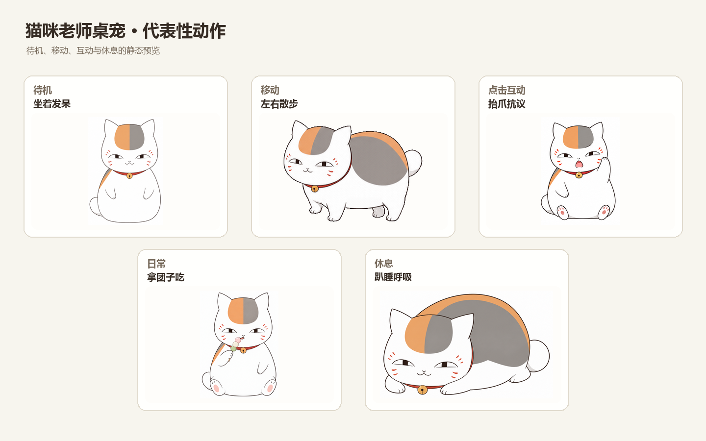
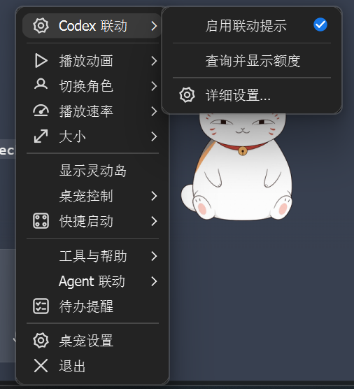
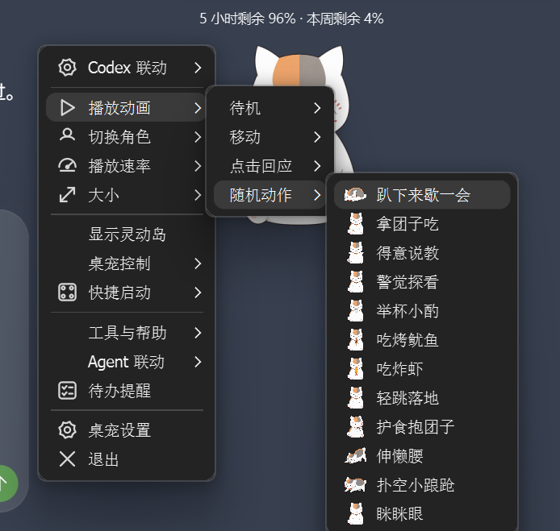

# 猫咪老师桌宠

Windows x64 桌面宠物，以《夏目友人帐》的猫咪老师（斑，招财猫形态）为角色，基于 [dsh-pet-indesktop](https://github.com/MerZlin/dsh-pet-indesktop) 改编。包含待机、点击、团子、左右散步与小跑、探看、小酌、烤鱿鱼、炸虾、轻跳、“眯眯眼”及桌面 Codex 状态提示。

## 动作展示

用静态关键帧展示桌宠的几类常见状态：坐着发呆、左右散步、抬爪抗议、拿团子吃和趴睡呼吸。



## 菜单展示

右键菜单把 Codex 联动、动作播放和桌宠控制放在一起。动画列表按待机、移动、点击反馈和随机动作分类，并配有动作缩略图，方便直接挑选。





## Codex 联动

启用“Codex 联动”后，桌宠会跟随 Codex 对话事件显示状态：开始回复时显示“对话中”，并可同时保留额度标签；一轮完成或中断时短暂显示提示，随后刷新额度。额度标签默认常驻在桌宠上方，不需要等到对话结束才手动查询。


想主动查看时，可以从“Codex 联动”子菜单选择“查询并显示额度”。“详细设置”可以分别控制是否显示对话中、完成、中断和额度，以及额度是否常驻；关闭常驻后可选择显示 5 秒、15 秒、30 秒或 1 分钟。

常驻文字采用透明背景、白字细深色描边和轻阴影，在浅色桌面上也方便辨认；字号保持原有大小。

额度由本机已登录的 Codex CLI 通过只读的 `account/rateLimits/read` 查询，显示五小时和本周窗口的剩余百分比。桌宠 Hook 只接收 Codex 的开始、完成和中断事件，不读取或保存对话正文、回答内容、转录或账号凭据；本地仅记录事件类型、会话/轮次标识和时间戳。Hook 需要在 Codex 中查看并信任，配置方法见下方安装说明。

## 下载与安装

Ubuntu 适配正在 `ubuntu-support` 临时分支验证，共用动作资源；启动、可选 Codex 联动及实机验收步骤见 [Ubuntu 指南](docs/UBUNTU.md)。当前正式 Release 的安装包仍为 Windows 版。

到 [Releases](https://github.com/sfeng13/nyanko-sensei-pet/releases/latest) 下载其中一种。附件名包含版本号，例如 `NyankoSensei-v0.5.4-Windows-x64-Online-Setup.zip` 和 `NyankoSensei-v0.5.4-Windows-x64-Offline.zip`：

- **Online-Setup.zip：在线引导安装。** 下载的是小型引导包（当前 v0.5.4 约 6 KiB），解压后双击 `Setup.cmd`。首次安装时需要联网，安装器会下载完整运行内容并校验 SHA-256。
- **Windows-x64-Offline.zip：完整安装包。** 直接下载整个桌宠包（当前 v0.5.4 约 275 MiB）；下载完成后无需再联网获取运行内容。解压后双击包内 `Setup.cmd` 安装。

两种方式安装相同版本，都会安装到 `%LOCALAPPDATA%\Programs\NyankoSensei`，只影响当前 Windows 用户，不需要管理员权限，也不要求目标电脑预装 Python。当前 v0.5.4 的完整安装目录约 590 MiB；各版本的精确体积见发布附件 `SIZE_REPORT.md`，`SHA256SUMS.txt` 提供下载包校验值。安装完成后桌宠可以离线启动。

安装器默认勾选“启用 Codex 联动”。取消勾选会确保桌宠自己的 Hook 处于关闭状态。安装与修复前会备份已有 `%USERPROFILE%\.codex\hooks.json`；只合并或移除猫咪老师自己的三个事件，不覆盖其他 Hook。安装器不会替你信任 Hook：请在 Codex 中查看 `/hooks` 并审阅、信任这些定义后，它们才会运行。若更改过 `CODEX_HOME`，安装器会使用该目录下的 `hooks.json`。联动不保存对话正文、转录或账号凭据，只记录会话/轮次标识和开始、完成、中断事件。额度读取由已登录的 Codex CLI 完成；未安装或未登录时额度状态会显示不可用。

开始菜单中的“Codex 联动管理”可以修复或关闭联动。“卸载猫咪老师桌宠”会移除桌宠自身的 Hook 与程序文件，保留其他 Hook、个人设置和日志。个人数据位于 `%LOCALAPPDATA%\NyankoSensei`。

## 重新构建

这里的“重新构建”是指开发者先获取本仓库源码（例如用 `git clone` 或下载 GitHub 的源码 ZIP），再从源码、角色素材和依赖锁文件生成安装包。构建脚本会下载固定版本的 Python embeddable 发行包、安装锁定的运行依赖、编译启动器和无窗口 Hook 转发器，最后在本地 `dist/` 生成在线引导包、完整离线包、SHA-256 清单与体积报告。源码仓库不保存嵌入式 Python 环境和生成的安装包。

普通使用者不需要下载源码或重新构建，直接从 Releases 下载上面的安装包即可。运行构建脚本只会生成本地文件，不会更新 GitHub Release；Release 发布由推送 `v*` 标签触发 GitHub Actions。改 README 或动画展示图也不需要重新构建安装包。

本地构建需要 Windows x64、PowerShell 7、Python 3.13.14 x64 和 Windows 自带的 .NET Framework C# 编译器：

```powershell
./packaging/build_windows.ps1 -Version v0.5.4
```

如果本机已有兼容的 Python 3.13.14 嵌入环境，可仅用于本地复现：

```powershell
./packaging/build_windows.ps1 -Version v0.5.4 -PythonRuntimeSource C:\path\to\python313
```

正式发行由推送 `v*` 标签触发 `.github/workflows/publish-windows.yml`，在 Windows x64 构建机上重新生成并上传发布附件。任何本地运行环境都不会被提交到 Git。

## 目录

- `app/`：桌宠上游程序源码及本仓库保留的修改。
- `characters/nyanko-sensei/`：角色清单和运行动画素材。
- `nyanko_runtime.py`、`nyanko_choreography.py`：猫咪老师动作编排与桌面联动。
- `nyanko_codex_hook.py`、`nyanko_codex_link.py`、`scripts/codex_hooks.py`：Codex 事件桥接、额度读取和 Hook 配置管理。
- `packaging/`：Windows 用户级安装器、启动器、Hook 转发器和构建脚本。

## 来源与说明

桌宠核心基于上游提交 `0da5f1616862187a38fd3e0db85faafbd6a4f456`，上游 MIT 许可和第三方通知见 `app/LICENSE`、`app/THIRD_PARTY_NOTICES.md`。猫咪老师动画为本项目角色素材。该桌宠为非官方粉丝作品，与《夏目友人帐》版权方无关联。
